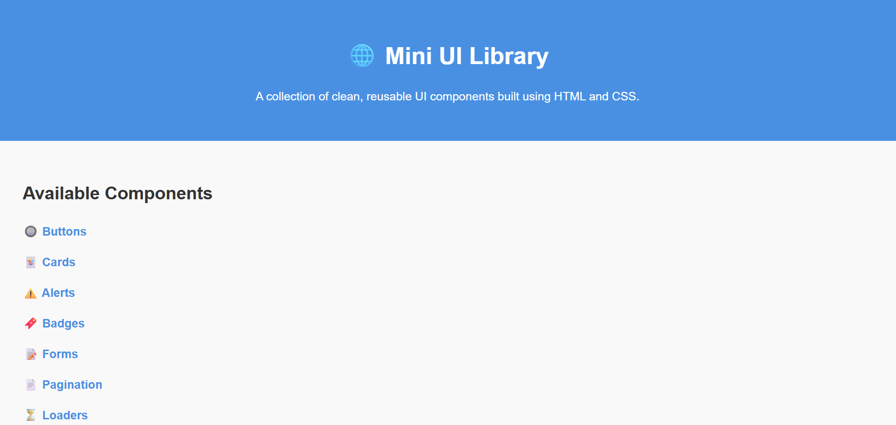

# ✨ Mini UI Library

A lightweight and responsive mini component library built using only HTML and CSS — no JavaScript, no frameworks. Clean, minimal, and easy to use in your personal or academic projects.

---

## 📁 Components Included

- ✅ Buttons
- ✅ Cards
- ✅ Alerts
- ✅ Badges
- ✅ Forms
- ✅ Pagination
- ✅ Loaders
- ✅ Modals

Each component is designed to be responsive, customizable, and simple to integrate.

---

## 🚀 How to View

Just open `index.html` in any browser. Each component has a link to its own page.

---

## 📂 Folder Structure

```
mini-ui-library/
├── index.html
|   ── style.css
├── components/
│ ├── buttons.html
│ ├── cards.html
│ ├── alerts.html
│ ├── badges.html
│ ├── forms.html
│ ├── pagination.html
│ ├── loaders.html
│ └── modals.html
└── assets/
    └── (images, icons if any)
```

---

## 📸 Preview




---

## 🤝 Contributing

Pull requests are welcome. If you'd like to improve a component or add a new one, feel free to fork and contribute!

---

## 💡 License

MIT – feel free to reuse with credit.

---